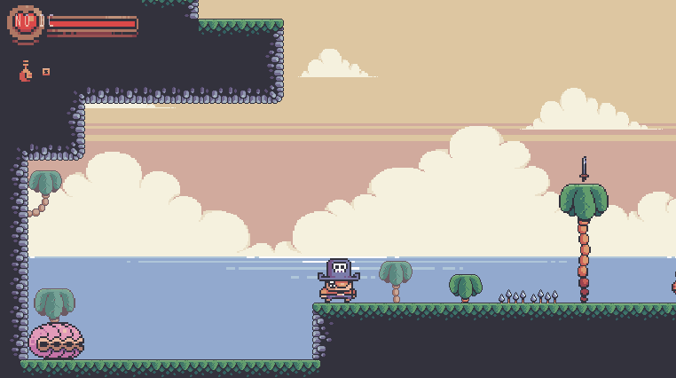
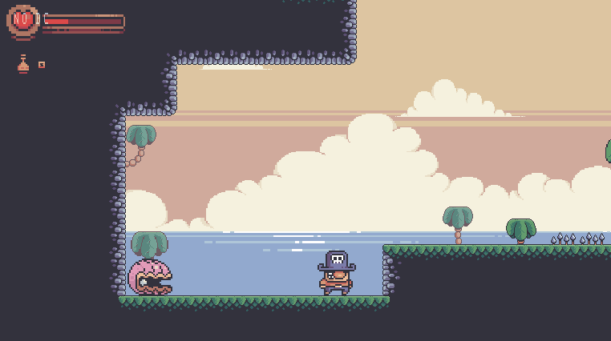
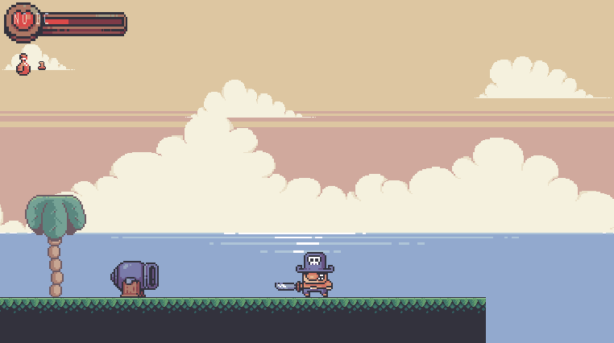
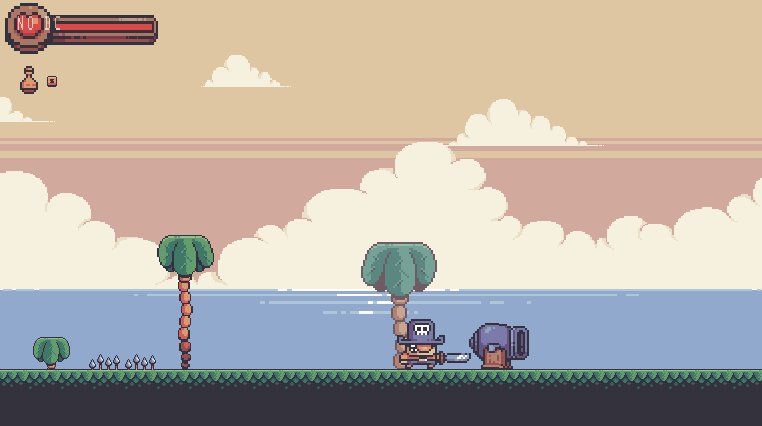
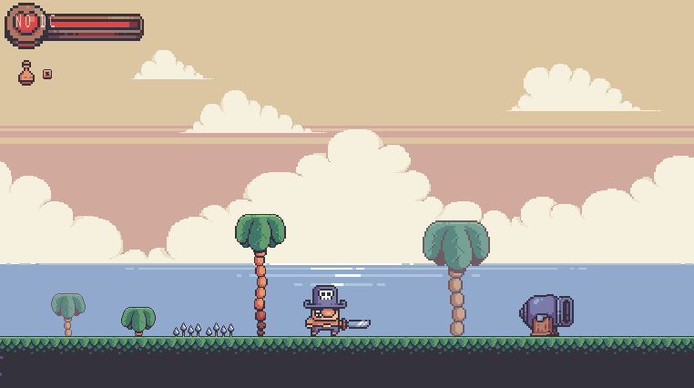
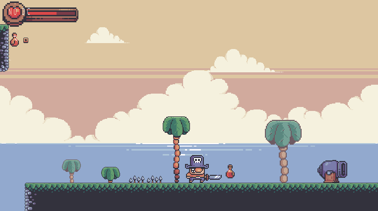

  

 

 Demo of a 2D action platformer, made in Godot with GDScript.
 
 # Pickup Weapons and Potions
 
 
 ## Dodge Enemy Projectiles
 
 
 
 ## Combat Up Close
 
 
 ## Attack From Afar
 

 ## Beware Traps
 
 
 ## Use Potions to Heal
 
